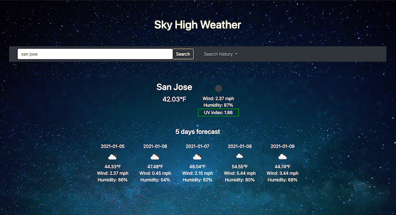

# Server-Side APIs: Weather Dashboard


## Description

This is a weather forecast application that runs in the browser and feature dynamically updated HTML and CSS. The API [OpenWeather API](https://openweathermap.org/api) is used for retrieving weather data from a third-party. 

<br>This application is mobile friendly by using a horizontal scroll bar to handle overflow content.

<br>Check out the deployed link [here](https://uyennguyen30696.github.io/hw6-weather-dashboard/).



## User Story

```
AS A traveler
I WANT to see the weather outlook for multiple cities
SO THAT I can plan a trip accordingly
```

## Criteria

```
GIVEN a weather dashboard with form inputs
WHEN I search for a city
THEN I am presented with current and future conditions for that city and that city is added to the search history
WHEN I view current weather conditions for that city
THEN I am presented with the city name, the date, an icon representation of weather conditions, the temperature, the humidity, the wind speed, and the UV index
WHEN I view the UV index
THEN I am presented with a color that indicates whether the conditions are favorable, moderate, or severe
WHEN I view future weather conditions for that city
THEN I am presented with a 5-day forecast that displays the date, an icon representation of weather conditions, the temperature, and the humidity
WHEN I click on a city in the search history
THEN I am again presented with current and future conditions for that city
WHEN I open the weather dashboard
THEN I am presented with the last searched city forecast
```
